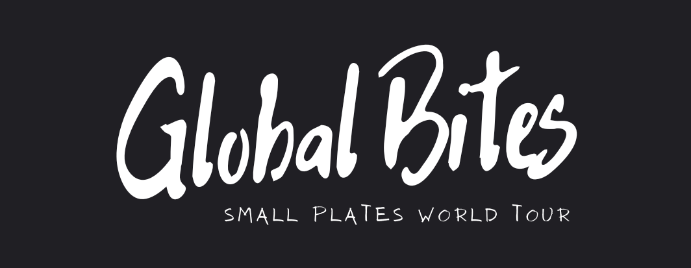

I'm excited to share with you to Global Bites, a fictional business website developed using Django Framework as part of Portfolio Project 3. 

## Inspiration & Storytelling 

As someone who loves exploring different foods, I wanted to create a business idea that would allow others to experience the same joy and excitement that comes with trying new cuisines.

My inspiration for the rotating menu every three months came from the game Subway Surfers, where they constantly change their themes to keep the game fresh and exciting. I thought that bringing the same concept to Global Bites would make the culinary experience more dynamic and engaging.

I also believe in sustainability and supporting local businesses, which is why I created menus that are environmentally friendly and seasonally based. Using fresh and nutritious ingredients at a fair price not only benefits the environment but also ensures that everyone can enjoy the authentic flavors of different cultures.

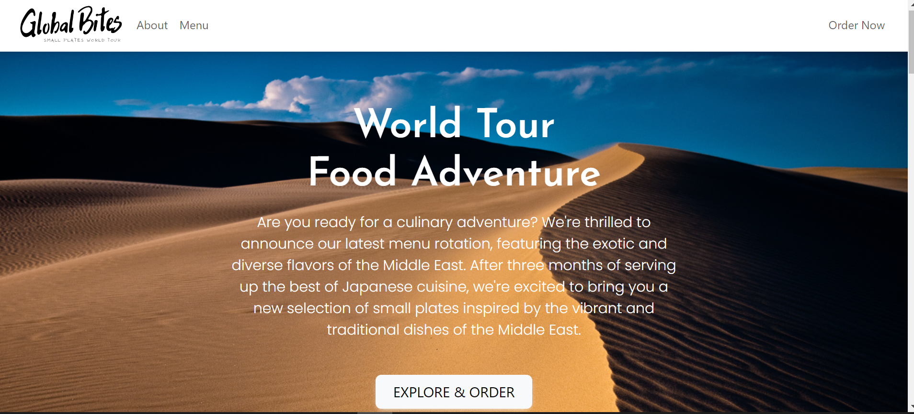 

You can view the live site here:- https://incredible-india.herokuapp.com/

----

## [Content](#content)
- [Incredible India - Introduction](#incredible-india---introduction)
  - [User Experience - UX](#user-experience---ux)
    - [Aims](#aims)
    - [Agile Methodology](#agile-methodology)
      - [Epics and User Stories](#epics-and-user-stories)
      - [Tasks](#tasks)
  - [Design](#design)
    - [Colours](#colours)
    - [Typography](#typography)
    - [Imagery](#imagery)
    - [Wireframes](#wireframes)
  - [Database Diagram](#database-diagram)
  - [Features](#features)
    - [Home Page](#home-page)
      - [Navbar](#navbar)
      - [Hero Image](#hero-image)
      - [Destination Section](#destination-section)
      - [Footer](#footer)
    - [User Page](#user-page)
    - [About Page](#about-page)
    - [Blog Page](#blog-page)
      - [Blog Details](#blog-details)
      - [Blog Comments](#blog-comments)
    - [Register](#register)
    - [Login](#login)
    - [Logout](#logout)
    - [Destinations](#destinations)
    - [Search Button](#search-button)
    - [Alert Messages](#alert-messages)      
  - [Admin Panel/Superuser](#admin-panelsuperuser)
  - [Technologies Used](#technologies-used)
    - [Languages Used](#languages-used)
    - [Django Packages](#django-packages)
    - [Frameworks - Libraries - Programs Used](#frameworks---libraries---programs-used)
  - [Testing](#testing)
      - [Validation](#validation)
      - [Manual Testing](#manual-testing)
  - [Bugs](#bugs)
      - [Fixed Bugs](#fixed-bugs)
      - [Unfix Bugs](#unfix-bugs)
  - [Deployment](#deployment)
      - [Creating the Django project](#creating-the-django-project)
      - [Creating Heroku app](#creating-heroku-app)
      - [Set up Environment Variables](#set-up-environment-variables)
      - [Heroku deployment](#heroku-deployment)
      - [Final Deployment](#final-deployment)
  - [Credits](#credits)
    - [Content](#content)
    - [Information Sources / Resources](#information-sources--resources)
  - [Acknowledgement](#acknowledgement)

-----

# User Experience - UX

## Aim 

1. To offer a unique culinary experience to its customers by showcasing the diverse cuisines and cultures of different countries through the art of small plates. The company is passionate about using food as a way to connect people and take them on a journey around the world with each bite.

2. Global Bites' commitment to changing its menu every three months ensures that customers can always expect something new and exciting on their plate, and that they are exposed to a variety of cuisines from different countries throughout the year. The dishes are carefully crafted with attention to detail and inspired by the vibrant and diverse cultures of different regions, from the fragrant spices of the Middle East to the fresh flavors of Southeast Asia.

3. The company's online ordering system provides customers with a convenient way to experience the world of small plates from the comfort of their own home, making it an excellent option for both seasoned foodies and those looking to try something new. 

4. Global Bites uses locally sourced and seasonal ingredients to reduce their carbon footprint and ensure high-quality, flavorful dishes. Their commitment to sustainable practices showcases their dedication to being an environmentally friendly and socially responsible business.

## Agile Methodology

The development of the Global Bites website was planned using agile methodology which allowed for flexibility in adapting to changing requirements during the development process. Plus the Kanban board helped to visualise the project's progress and prioritise tasks effectively. I was able to break down the project into smaller tasks and work to achieve each milestone.

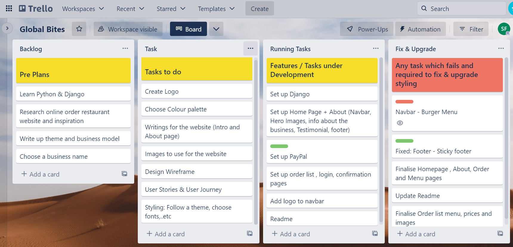 
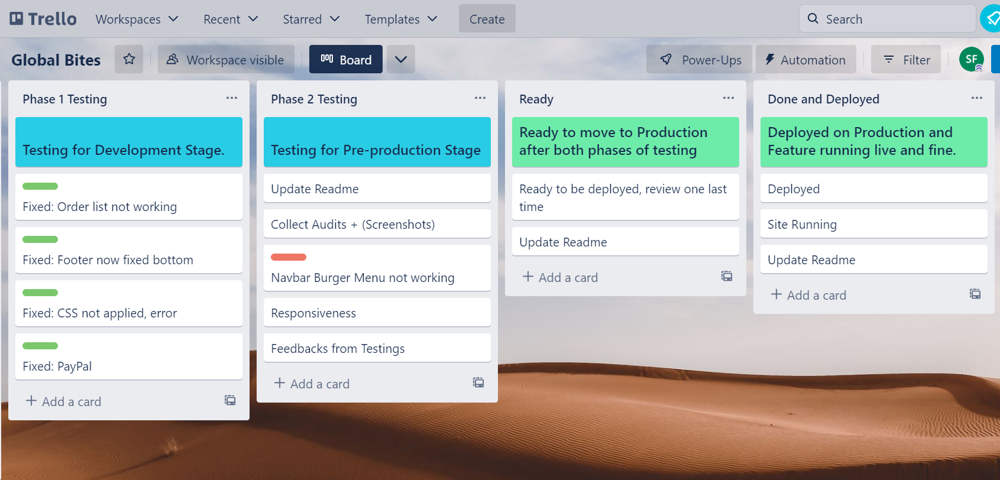 

* Backlog- Pre Plans
* Task- Task to do
* Running Task - Task under development 
* Fix & upgrade- Debug and style 
* Tasting 1 - Testing 1
* Testing 2 - Testing 2
* Ready - Ready for Deployment 
* Done & Deployed - Site is live and deployed

## Target

1. Foodies and culinary adventurers living in or visiting London who are interested in exploring diverse cuisines and experiencing new flavors from around the world through the art of small plates.

2. Environmentally-conscious consumers who prioritize sustainability and reducing their carbon footprint, and who are interested in supporting a local business that sources ingredients locally and uses eco-friendly practices.

3. Corporate clients and event planners looking to provide their employees or guests with a unique and memorable culinary experience that fosters a sense of community and enhances morale.

4. Health-conscious individuals seeking fresh and nutritious cuisine made with seasonal ingredients, and who are interested in exploring global flavors in a way that supports sustainable and ethical practices.

5. Friends and families looking for a fun and unique dining experience, whether for a special occasion or simply a night out.

### User Personas

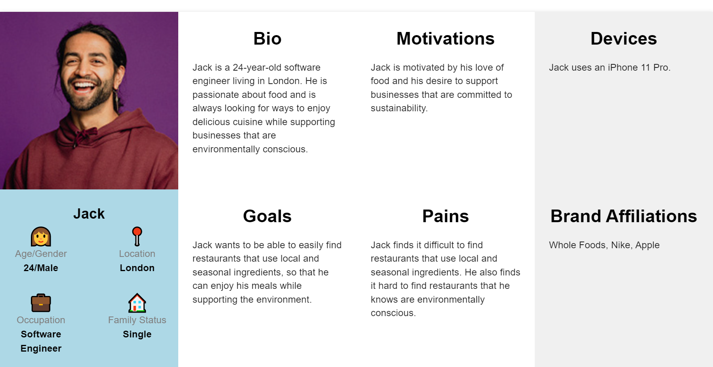

 1.  Sarah is a busy professional who loves trying new foods but doesn't have time to visit restaurants. She discovers Global Bites online and is excited. She places an order for delivery, and is impressed with how easy it is to use the website and how quickly her food arrives. She loves the flavors and the convenience, and becomes a regular customer.

2. David is a student who is new to the city and looking for a unique dining experience. He comes across Global Bites and is impressed with the menu and the online ordering system. He decides to try the restaurant for a date night and is blown away by the flavors and the atmosphere. He shares his experience on social media and recommends Global Bites to his friends.

3. Maria is a fitness enthusiast who follows a strict diet. She discovers Global Bites and is pleased to see fresh and nutritious food. She orders online and is able to find dishes that fit her dietary requirements. She is impressed with the quality and flavor of the food, and becomes a regular customer.

4. Jenna is planning a party and wants to impress her guests with unique and flavorful dishes. She comes across Global Bites and is pleased to see that they offer catering services. She contacts the restaurant and is impressed with the helpful and responsive customer service. She places an order for catering and is delighted with the quality and presentation of the food. Her guests rave about the dishes, and she becomes a loyal customer.

5. Joe, would like to use Global Bites catering service to offer his employees a unique and diverse culinary experience at our company retreat, so that her can boost morale and foster a sense of community within my team while keeping everyone well-fed and happy.

### User Goals 

* As a user I would like to use the search bar for quick and easy access to the menu 
* As a user  I would like the website to be fast and responsive, with clear navigation and an intuitive layout that makes it easy for users to find what they're looking for.
* As a user I would like the website to have an easy-to-use online ordering system that allows us to place orders and pay securely through the website.
* As as user I would like to have a user account system that allows customers to track their order history. 
* As a user I would like to see reviews and ratings of the business
* As a user I would like to learn a little about the cuisine selected 
* As a user I would like to see the menu offerings of Global Bites, with clear descriptions and photos that entice us to try new dishes.
* As a user I would like to have visually appealing and consistent brand experience across all devices and platforms, including desktop, mobile, and tablet.
* As a user who who values supporting local businesses, I would like to know that Global Bites uses locally-sourced and seasonal ingredients whenever possible, so that I can feel good about where my money is going and the impact it has on my community.
* As a health-conscious consumer, I would like to know that Global Bites uses fresh and seasonal ingredients in their dishes, so that I can feel good about what I'm eating and trust that it is both delicious and nutritious.

### First Time Visitor 
 - Learn about the concept of small plates and what they offer
 - Learn about the values and mission of the restaurant, including their commitment to sustainability and using fresh, locally-sourced ingredients, to feel good about supporting a business that aligns with their own values.
 - Learn about the cuisine and their food they offer
 - View reviews and testimonials from previous customers to get a sense of the quality of the food and the overall dining experience, and to feel confident in placing an order online.

 ### Returning Visitor 

 - Check the current menu and rotating schedule to see if any new cuisines or dishes have been added since their last visit, and to get excited about trying something new.
 - Place an order for delivery or pickup, using the online ordering system to make the process quick and convenient.
 - Refer a friend or family member to Global Bites, either by sharing the website or recommending the restaurant in person, to help spread the word about this unique culinary experience.

 ### Frequent Visitor 

- Check the current menu and rotating schedule to see if any new cuisines or dishes have been added since their last visit, and to get excited about trying something new.
 - Place an order for delivery or pickup, using the online ordering system to make the process quick and convenient.
 - Refer a friend or family member to Global Bites, either by sharing the website or recommending the restaurant in person, to help spread the word about this unique culinary experience.
 - Request a special order for their favorite dish, or make a suggestion for a new dish or cuisine to be added to the rotating menu.
 - Request nutritional information or dietary guidelines for specific dishes, allowing them to make informed choices that align with their personal health goals or preferences.

  

--- 
 
 [Back to top](#content)

# Design 

## Wireframe : Figma 

1. Home Page:
 
  - Header with logo and navigation links (Home, About, Menu, Order)
  - Hero image showcasing the cuisine's theme 
  - Section highlighting the benefits of choosing Global Bites, including its commitment to using fresh, seasonal, and locally-sourced ingredients, and its mission to showcase diverse global cuisines
  - Section division using images 
  - Testimonials section with quotes from satisfied customers
  - Footer with links to social media pages and login in

2. About Page: 
 
  - Header with logo and navigation links (Home, About, Menu, Order)
  - Section providing an overview of Global Bites
  - An image of the team behind the scene who are enjoying Global Bites
  - Footer with links to social media pages and login in 

  

3. Menu Page:
 
  - Header with logo and navigation links (Home, About, Menu, Order)
  - Search bar for filtering by cuisine or dish name
  - Section showcasing menu with thumbnail images and brief descriptions
  - Footer with links to social media pages and login in 

  

4. Order Page:
 
  - Header with logo and navigation links (Home, About, Menu, Order)
  - Section showcasing different cuisine categories with thumbnail images, prices and brief descriptions
  - Upon clicking "Checkout", the user is prompted to login or sign up to complete the order process
  - Upon completion of the order, the user is taken to a confirmation page with details about the order and estimated delivery time
  - Dashboard page where admin/users can view their order history, update account settings, and track current orders
  - Login and Sign up pages for new users or returning customers who need to create an account

## Brand & Logo: Canva

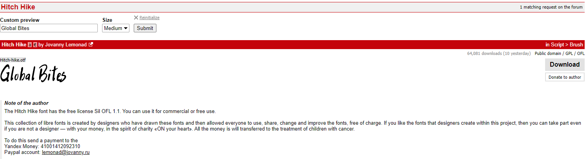

I chose a handwriting font (Hitch Hike / Antio) for my logo as it gave my brand a unique and personalised touch that stands out from other food businesses. The handwriting font also reflects my brand's personality, which focuses on diverse small plates from around the world, conveying the message that my food is authentic, delicious, and distinct. Using Canva to edit the logo was easy and cost-effective.. Overall, I'm happy with the final result and believe that it helps create a professional brand image.

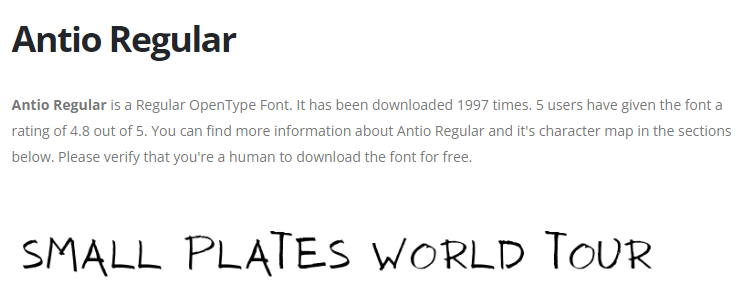

I decided to go with "Small plates world tour" as I believe it’s a great slogan for a restaurant that serves small plates from around the world. It's catchy, memorable, and suggests that customers can try a variety of international dishes without leaving their seats. The use of the word "world" makes the slogan more inclusive and indicates that the restaurant offers diverse menu options. 

## Colour Palette: Canva

I decided to go for a black and white colour theme for my website because my food pictures are already colourful. It looks clean and sophisticated, making it easy for people to use.

In the future, I might add themed colours that go with my menu for that month. This could make my website look even more exciting and add a sense of anticipation for my customers. Overall, using a black and white colour theme for my website was a good idea, and adding themed colours could make it even better.

## Typography: Google Font / Bootstrap 
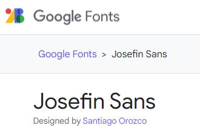
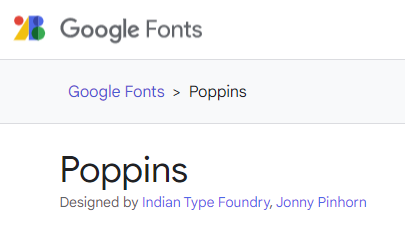

For Global Bites, I carefully selected fonts that would help communicate the right message to my targeted customers. I chose 'Josefin Sans' for headings because it has a clean, modern, and elegant appearance that aligns well with the restaurant's concept. 'Poppins' was my choice for paragraphs because it's easy to read and complements 'Josefin Sans' nicely.

To maintain consistency and professionalism, I also used 'Josefin Sans' for subheadings. While I opted for these specific fonts in most cases, I also used some fonts provided by Bootstrap for certain elements of my website.

----

## Desktop, Tablet & Mobile Responsiveness 

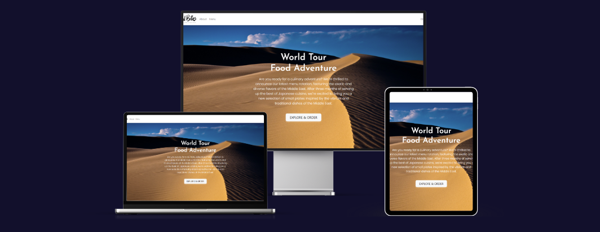

I used a framework called Bootstrap 4 to create the website. Bootstrap comes with pre-made buttons and forms that are easy to use and saves time. Bootstrap also makes the website fit on different screen sizes, making it easy to use on any device.

To make the website look good without starting from scratch, I used pre-made free components from Bootstrap, MDB, and Bootstrap Brain. Then, I customised these components to fit the branding of the business using CSS.
Using pre-made components helped me save time and made the website look consistent and professional throughout. 

## Database Control Flow

The MVT (Model-View-Template) model is a way of organising code in Django web development. When a user sends a request for a resource, Django searches for that resource and if it finds it, it calls the appropriate view. The view interacts with the model to get the necessary data from the database, and then sends that data to the template, which is responsible for rendering the data in a user-friendly way that can be displayed on the website. Finally, the template is sent back to the user's browser, allowing them to see the requested resource.

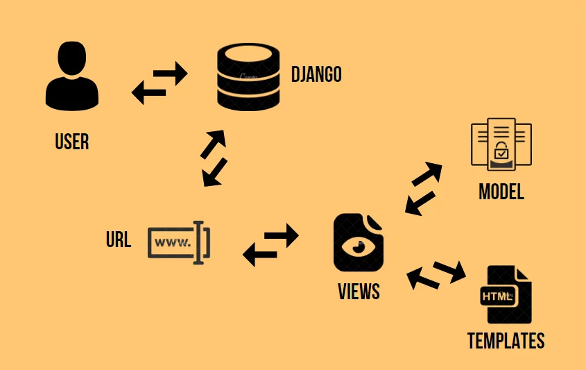

## Code

I built the website using a combination of different programming languages, tools and resources such as HTML, CSS, Python, Django, and Bootstrap. I started by following a youtube video tutorial by Legion Script that provided a step-by-step guide on building a food delivery web application using Django and Python 3.

The tutorial covered different aspects of building the website, including setting up basic pages like the index and about pages, creating an ordering system, implementing PayPal API with AJAX, creating staff login and restaurant dashboard, adding order details, creating a menu page, and adding a search bar.

Using the tutorial as a guide, I built my project by customising and modifying the code to fit the branding and specific needs of the food business. I used Gitpod as my development environment and stored the code on Github.

***
## Technologies used

- HTML
    - HTML is used to structure and use Bootstrap components by adding specific classes.
- CSS
    - CSS is used to style and personalise Bootstrap components used for the website
- Python
    - To provide the functionality to the site
- Django
    - Django was used o build the backend, it also enables rapid and secure development.
- [Bootstrap v4](https://getbootstrap.com/docs/5.3/getting-started/introduction/)
    - A set of pre-designed HTML, CSS, and JavaScript components was used to create responsive, mobile-first websites.
- Google Fonts
    - Google Fonts us used to embed for the website
- [Figma](https://www.figma.com)
    - The wireframe was pre-planned and designed via Figma.
- [Canva](https://www.canva.com/)
    - Canva was used for:
      - Granting copyright free images/graphics/videos
      - Designing and testing visuals
      - Resizing and downloading in PNG to support transparent background
     
- Bootstrap Brain, MDB Bootstrap, Bootstrap Form Builder
    - These websites allows copyright free frontend libraries, some of the bootstrap components were used for the website
- [QuillBot](https://quillbot.com/)
    - QuillBot was used to scan writings and alert any errors in grammar, spelling, punctuation as well as rephrase any research used for the website.
- [User Persona](https://userpersona.dev/)
    - The website helped to generate fictional characters to represent the website
- GitHub
    - Stores, manages, and track changes to the project code
- Chrome DevTools
    - Chrome DevTools helped to debug, inspect, test the website's responsive design and check performance analysis tools
- [Form Builder](https://bootstrapformbuilder.com/)
    - Form builder was used to build the form needed alongside with the bootstrap used

***

# Credits
- Code institute Course Materials
- W3 School
- YouTube: Legion Script
- YouTube: Mosh
- Django Documentation 
- FreeCodeCamp

***

# Acknowledgements
- My tutor at Westminster Adult Education Service, Richey Malhotra. A big thanks.
- My classmates and team at Westminster Adult Education Service who have been kind to help one another when in need, share ideas and jokes around when working together!
- My partner Juan Carlos Diaz Lara, whom I am thankful for introducing me into this coding world and taking the journey with me. 

